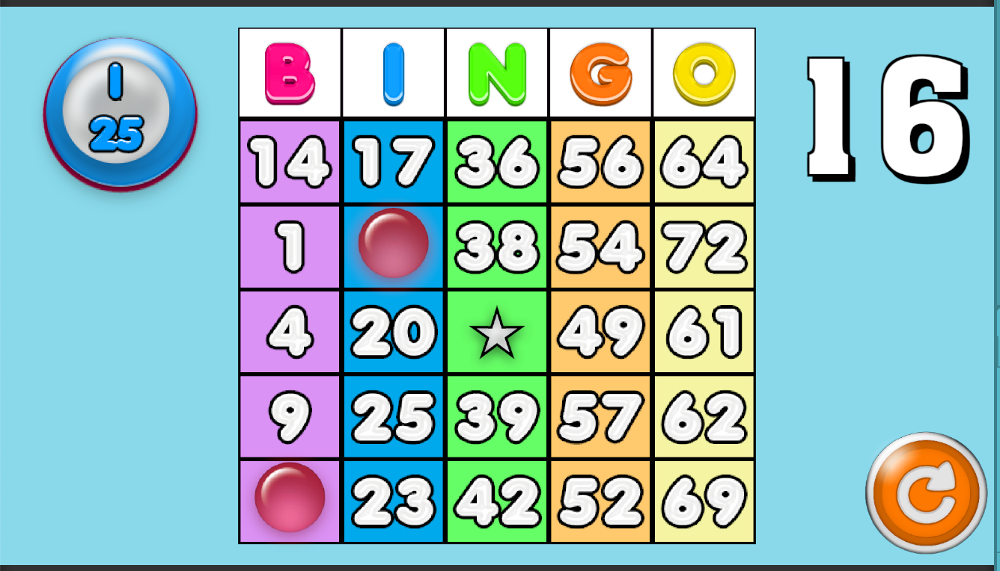

# 30 Second Bingo

Original speed Bingo Game built in Unity 
Play it [here](https://rskala.itch.io/30-second-bingo?secret=Sae1FWK7Bp0w7VYFtIiGStFZiU)!

#
### How to Play ###
* The currently called ball number will appear on the left.
* Click the corresponding bingo cell.
* Fill out the entire card before the time runs out!
* There are no bad call numbers in **30 Second Bingo**!

#

This was an original concept I had for a quick-playing Bingo game a while back. I originally built it in pure Unity UI (UGUI) as an experiment, and I recently found it on an old hard drive (like my [Keno Game](https://github.com/RSkala/KenoGame_OG)). I wanted to rebuild it using actual bingo assets.

I still need to implement a proper game over and game loop.

#
Assets created by Melchex and legally purchased from [GameDev Market](https://www.gamedevmarket.net/member/melschex):

#

